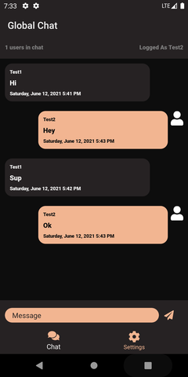

# Xamarin Chat SignalR

# Features/goals
- Material UI
- Modern Global Chat
- Walkthrough
- Settings
- Dark & Light Theme
- Multiple Language Support
- App Share & Rate
- Multiple Serialization Methods with Encryption
- Tab badges
- Font Awesome

### Light Theme

### Dark Theme

# Usage

### Setup
1. Launch the SignalR chat ASP.NET web app using [conveyor](https://conveyor.cloud?utm_source=conveyor&utm_medium=linkshare&utm_campaign=conveyor) extension to enable local link access and copy the conveyor URL.
2. Open the project and head to App.cs and setup the hubconnection url (line 33, PCL project).
3. Launch the Android or iOS project.

[Youtube Tutorial](https://youtu.be/XJHMjS201nw) (5 min)

## Tested Environment

### Android
Phone & Tablets
9.0 -> 11.0
### iOS
iPhone & iPads
10.0 -> 14.5

# Future updates
- Add Friends tab
- Chatting Rooms
- Chat Moderation
- Notifications
- UWP Support
- .NET 6 Support

### Follow me on twitter
[Twitter](https://twitter.com/jihadkhawaja)
