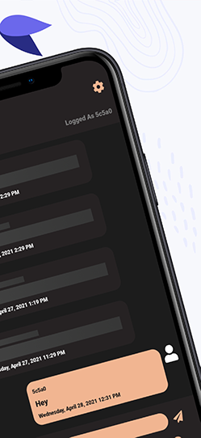

# Xamarin Chat SignalR

# Features/goals
- Material UI
- Modern Global Chat
- Walkthrough
- Settings
- Dark & Light Theme
- Multiple Language Support
- App Share & Rate

# Future updates (★ 100)
- Add Friends tab
- Chatting Rooms
- Chat Moderation
- UWP Support

# Usage

### Setup
1. Open the project and head to App.cs and setup the hubconnection url (line 33, PCL project).
2. Launch the SignalR chat web app using [conveyor](https://conveyor.cloud?utm_source=conveyor&utm_medium=linkshare&utm_campaign=conveyor) extension to enable local link access and copy the conveyor chathub URL.
3. Launch the Android or iOS project.

## Tested Environment

### Android
Phone & Tablets
9.0 -> 11.0
### iOS
iPhone & iPads
10.0 -> 14.5

## ★ Star this repo to help others find it

### Follow me on twitter
[Twitter](https://twitter.com/jihadkhawaja)
