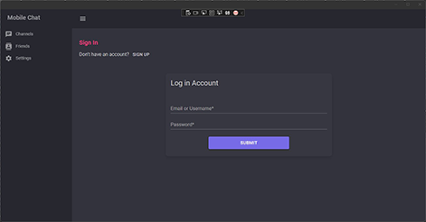
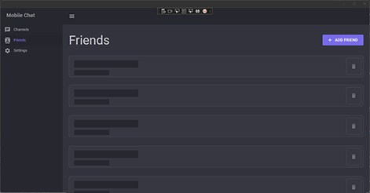
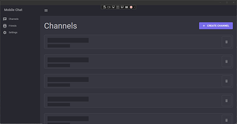
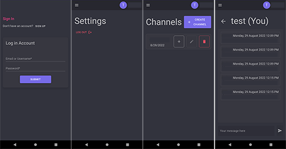

# About
MAUI Client with ASP.NET SignalR Server.

Self-host chatting solution with cross-platform client application.

## MAUI Supported Platforms
- Windows 7 or higher
- macOS 11 or higher
- Android 7.0 (API 24) or higher
- iOS 14 or higher

## WASM Supported Platforms
- Can be deployed to any browser that supports WebAssembly

# Documentation
Find everything you need to get started at the [Wiki](https://github.com/jihadkhawaja/MobileChat/wiki)

# Showcase

## Windows

## Android

### Features and Progress
Check what's coming in future releases [here](https://github.com/jihadkhawaja/MobileChat/projects/1)

### Contribution
Feel free to fork and **contribute** or **open an issue**. All contributions are welcome!

### Community
Join the [Discord server](https://discord.gg/9KMAM2RKVC) to get updates, ask questions or send a feedback.

#### Sponsors

    <a href="https://www.jetbrains.com/" align="right">
    <a>
     
        
Special thanks to [JetBrains](https://jb.gg/OpenSourceSupport) for supporting us with open-source licenses for their IDEs. </a>

