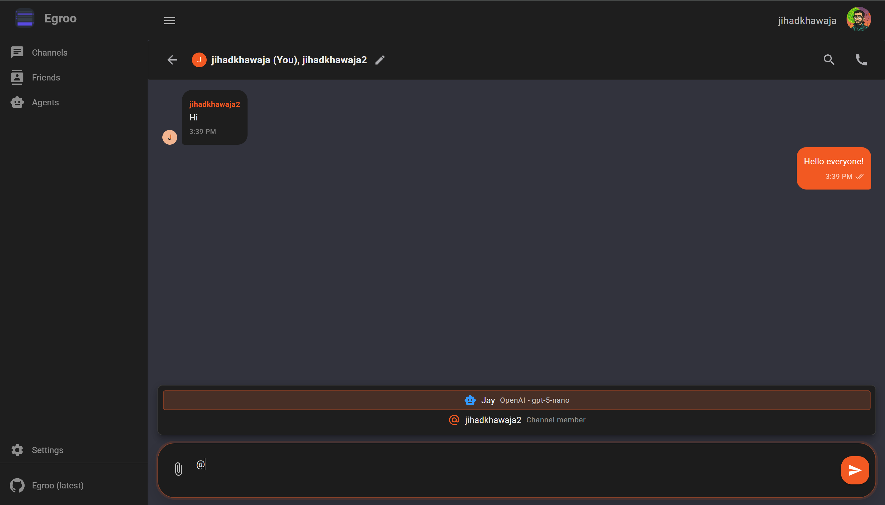
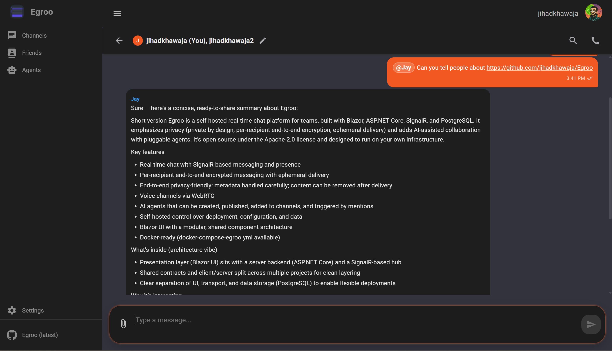
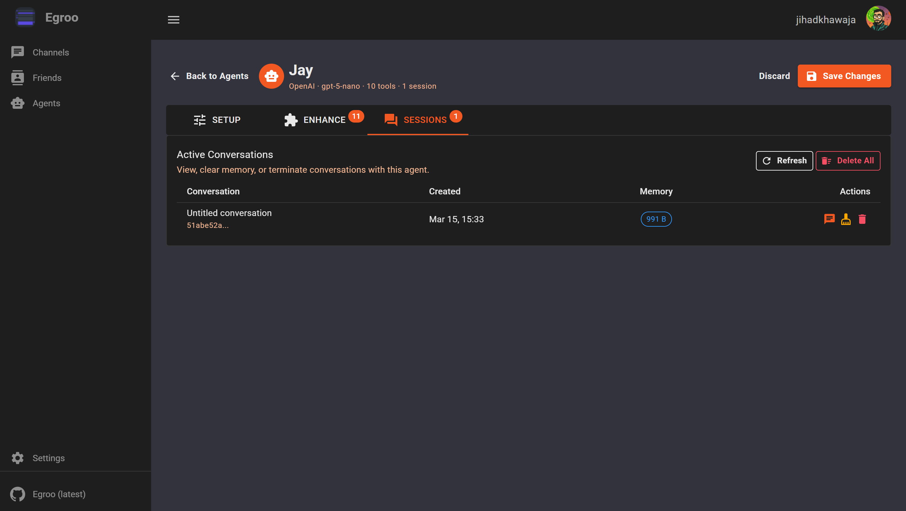
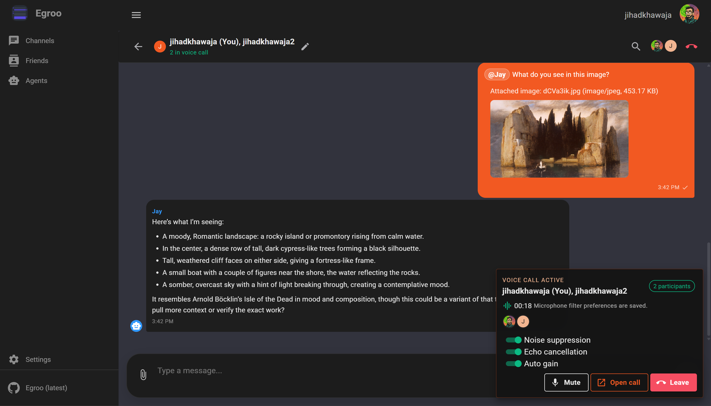
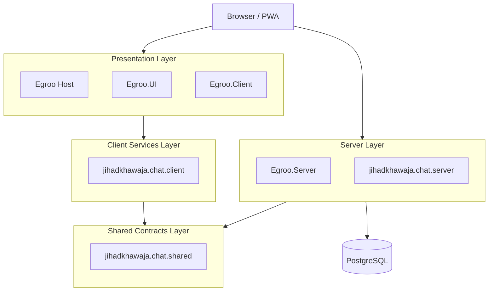
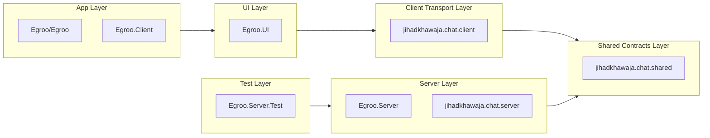
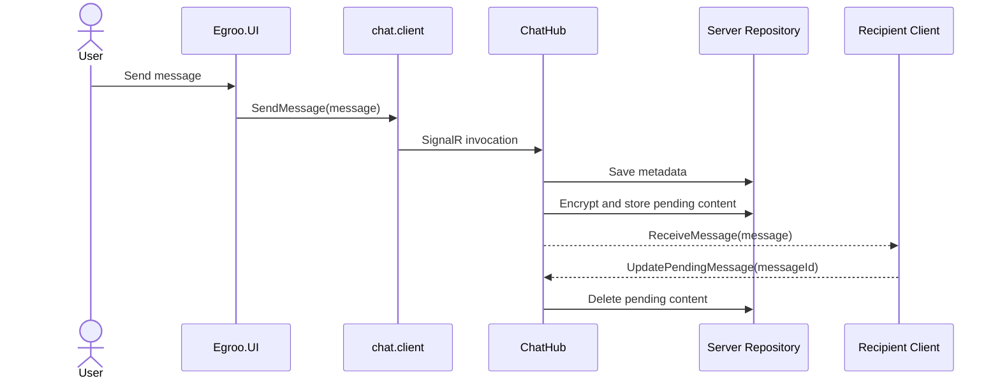
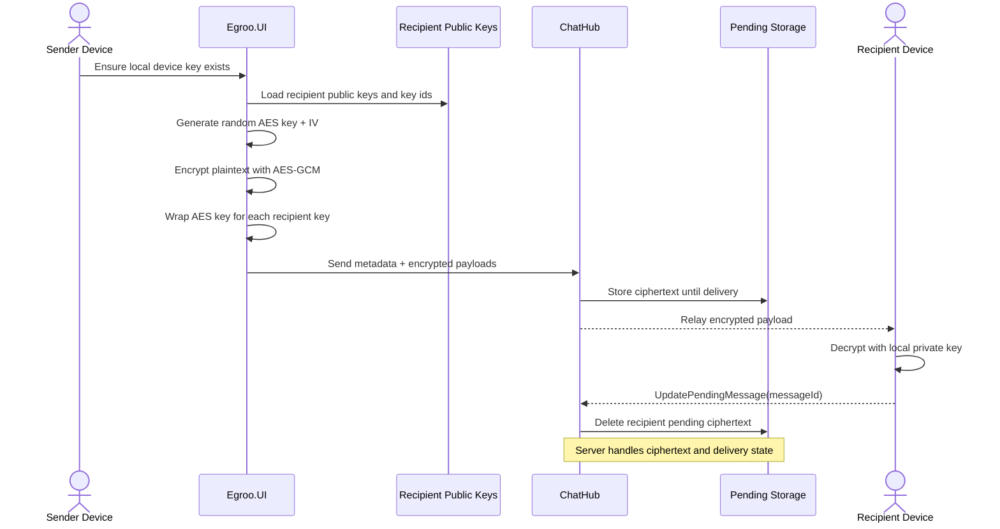
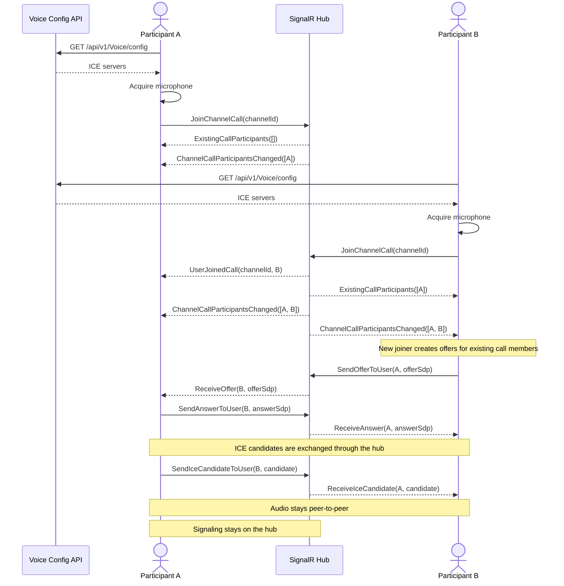
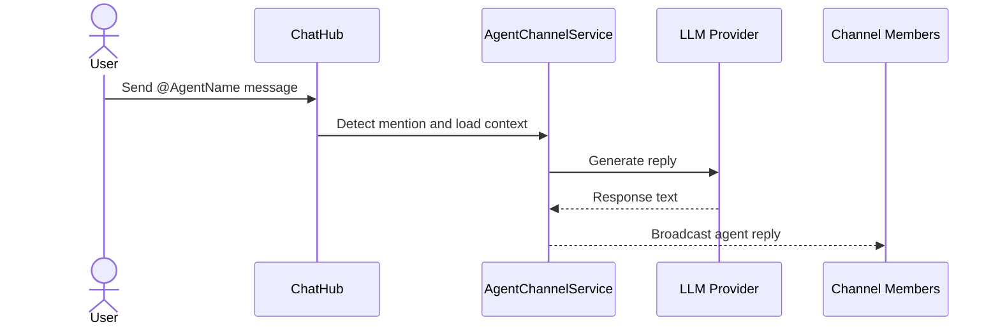

# [Egroo](https://www.egroo.org/)


Egroo is a self-hosted real-time chat platform built with Blazor, ASP.NET Core, SignalR, and PostgreSQL. It is designed for teams that want modern chat, channel voice, end-to-end encrypted messaging, and AI-assisted collaboration without giving up control of their infrastructure or data.

It combines a Blazor web experience, a SignalR-first real-time backend, per-recipient end-to-end encrypted messaging with ephemeral delivery, channel voice calls over WebRTC, server-provided ICE configuration for call setup, and optional AI agents that can participate in conversations when mentioned.

## Build Status

[](https://github.com/jihadkhawaja/Egroo/actions/workflows/Nuget.yml)
[](https://github.com/jihadkhawaja/Egroo/actions/workflows/MSTest.yml)
[](https://github.com/jihadkhawaja/Egroo/actions/workflows/deploy-egroo.yml)
[](https://github.com/jihadkhawaja/Egroo/actions/workflows/github-code-scanning/codeql)

## Why Egroo

- Self-hosted architecture with PostgreSQL storage and no third-party message relay.
- Blazor Auto rendering for fast first load with WebAssembly after hydration.
- SignalR-based real-time messaging and presence.
- End-to-end encrypted messaging with per-recipient payloads.
- Ephemeral encrypted message delivery for stronger privacy.
- WebRTC channel voice calls.
- AI agents that can be created, published, added to channels, and triggered with mentions.

## Core Capabilities

| Capability | What it means |
|---|---|
| Real-time chat | Fast message delivery over SignalR WebSockets |
| End-to-end encrypted messaging | Per-recipient payloads are encrypted with recipient public keys and decrypted on the receiving device |
| Privacy-first delivery | Message metadata is stored separately and encrypted pending content is removed after recipients acknowledge delivery |
| Voice channels | In-channel WebRTC audio with SignalR membership and signaling plus API-delivered ICE/TURN configuration |
| Blazor UI | Shared Razor components across server and WebAssembly experiences |
| AI agents | User-owned agents powered by OpenAI, Azure OpenAI, Anthropic, or Ollama |
| Self-hosting | Full control over deployment, configuration, and data |

## Quick Visual Tour

Egroo centers on a fast, modern chat workspace with built-in support for AI agents, multimodal prompts, agent session control, and group voice calls.

<table>
  <tr>
    <td width="50%">
      <a href="https://github.com/jihadkhawaja/Egroo/wiki/Showcase">
        
      </a>
    </td>
    <td width="50%">
      <a href="https://github.com/jihadkhawaja/Egroo/wiki/Showcase">
        
      </a>
    </td>
  </tr>
  <tr>
    <td width="50%">
      <a href="https://github.com/jihadkhawaja/Egroo/wiki/Showcase">
        
      </a>
    </td>
    <td width="50%">
      <a href="https://github.com/jihadkhawaja/Egroo/wiki/Showcase">
        
      </a>
    </td>
  </tr>
</table>

Want the full walkthrough with captions? See the [Product Showcase](https://github.com/jihadkhawaja/Egroo/wiki/Showcase).

## System Overview

At a high level, Egroo separates the web host, the API server, shared UI libraries, chat libraries, and database storage.


```mermaid
flowchart TD
  Browser["Browser / PWA"]
  Db[("PostgreSQL")]

  subgraph PresentationLayer["Presentation Layer"]
    direction TB
    Host["Egroo Host"]
    UI["Egroo.UI"]
    Client["Egroo.Client"]
  end

  subgraph ClientServicesLayer["Client Services Layer"]
    direction TB
    ChatClient["jihadkhawaja.chat.client"]
  end

  subgraph ServerLayer["Server Layer"]
    direction TB
    Api["Egroo.Server"]
    ChatServer["jihadkhawaja.chat.server"]
  end

  subgraph SharedLayer["Shared Contracts Layer"]
    direction TB
    Shared["jihadkhawaja.chat.shared"]
  end

  Browser --> PresentationLayer
  Browser --> ServerLayer
  PresentationLayer --> ClientServicesLayer
  ClientServicesLayer --> SharedLayer
  ServerLayer --> SharedLayer
  ServerLayer --> Db
```

## Solution Structure

The solution in `src/` is split by responsibility so the UI, transport layer, shared contracts, and server implementation remain independent.


```mermaid
flowchart LR
  subgraph AppLayer["App Layer"]
    direction TB
    EgrooHost["Egroo/Egroo"]
    EgrooClient["Egroo.Client"]
  end

  subgraph UiLayer["UI Layer"]
    direction TB
    UiProject["Egroo.UI"]
  end

  subgraph ClientLayer["Client Transport Layer"]
    direction TB
    ClientProject["jihadkhawaja.chat.client"]
  end

  subgraph SharedLayer["Shared Contracts Layer"]
    direction TB
    SharedProject["jihadkhawaja.chat.shared"]
  end

  subgraph ServerLayer["Server Layer"]
    direction TB
    ServerProject["Egroo.Server"]
    ChatServerProject["jihadkhawaja.chat.server"]
  end

  subgraph TestLayer["Test Layer"]
    direction TB
    TestProject["Egroo.Server.Test"]
  end

  AppLayer --> UiLayer
  UiLayer --> ClientLayer
  ClientLayer --> SharedLayer
  ServerLayer --> SharedLayer
  TestLayer --> ServerLayer
```

| Project | Purpose |
|---|---|
| `src/Egroo/Egroo` | Blazor host application that serves the web app and coordinates SSR to WASM rendering |
| `src/Egroo/Egroo.Client` | Client-side WebAssembly project |
| `src/Egroo.UI` | Shared Razor component library used by both hosting modes |
| `src/Egroo.Server` | ASP.NET Core backend with Minimal APIs, SignalR, repositories, EF Core, and PostgreSQL |
| `src/jihadkhawaja.chat.client` | Client services that wrap auth, channel, message, and call interactions |
| `src/jihadkhawaja.chat.server` | SignalR hub implementation and connection tracking |
| `src/jihadkhawaja.chat.shared` | Shared DTOs, models, and interfaces |
| `src/Egroo.Server.Test` | MSTest coverage for server behavior |

## How Messaging Works

One of Egroo's core design choices is that message content is not kept permanently in the main message record. The server stores metadata, carries per-recipient encrypted payloads, and removes pending encrypted content after acknowledgment.


```mermaid
sequenceDiagram
  actor User
  participant UI as Egroo.UI
  participant Client as chat.client
  participant Hub as ChatHub
  participant Repo as Server Repository
  participant Recipient as Recipient Client

  User->>UI: Send message
  UI->>Client: SendMessage(message)
  Client->>Hub: SignalR invocation
  Hub->>Repo: Save metadata
  Hub->>Repo: Encrypt and store pending content
  Hub-->>Recipient: ReceiveMessage(message)
  Recipient-->>Hub: UpdatePendingMessage(messageId)
  Hub->>Repo: Delete pending content
```

## How End-To-End Encryption Works

Egroo uses device-managed public key encryption for message transport. Each browser or device can generate its own RSA key pair locally, keep the private key in local storage, and publish only the public key plus a `keyId` to the server. The server never receives the device private key.

When a message is sent, the client or server-side encryption pipeline creates a random AES message key, encrypts the plaintext with AES-GCM, and then wraps that AES key separately for each intended recipient public key. The server stores message metadata in the `Message` record, stores the recipient-specific ciphertext in pending-message tables, and delivers only the matching encrypted payload to each recipient.

For users with multiple registered devices, Egroo can build a v2 transport envelope that contains multiple wrapped AES keys for the same ciphertext, one per device key. That lets any registered device for that user decrypt the same delivered message.


```mermaid
sequenceDiagram
  actor Sender as Sender Device
  participant UI as Egroo.UI
  participant Keys as Recipient Public Keys
  participant Hub as ChatHub
  participant Store as Pending Storage
  actor Recipient as Recipient Device

  Sender->>UI: Ensure local device key exists
  UI->>Keys: Load recipient public keys and key ids
  UI->>UI: Generate random AES key + IV
  UI->>UI: Encrypt plaintext with AES-GCM
  UI->>UI: Wrap AES key for each recipient key
  UI->>Hub: Send metadata + encrypted payloads
  Hub->>Store: Store ciphertext until delivery
  Hub-->>Recipient: Relay encrypted payload
  Recipient->>Recipient: Decrypt with local private key
  Recipient-->>Hub: UpdatePendingMessage(messageId)
  Hub->>Store: Delete recipient pending ciphertext

  Note over Hub,Store: Server handles ciphertext and delivery state
```

Important points:

- The server does not persist `Message.Content` for encrypted delivery in the main message table.
- Recipient-specific ciphertext lives in pending-message storage until the recipient acknowledges delivery.
- Clearing browser storage removes the local private key for that device, so previously delivered encrypted messages may become unreadable there.
- AI agents can also participate in the encrypted recipient model with their own public/private key identity, but agent private keys are server-protected rather than browser-held.

## How Voice Channel Calls Work

Voice calls are channel-scoped WebRTC audio sessions. Before joining, the client loads ICE server configuration from `/api/v1/Voice/config`, acquires the local microphone in the browser, and then joins the channel call through SignalR.

The hub validates channel membership, sends `ExistingCallParticipants` to the new joiner, sends `UserJoinedCall` to the existing call members, and broadcasts `ChannelCallParticipantsChanged` to online channel members so the UI can render live call presence. SDP offers, answers, and ICE candidates move through SignalR, while audio stays peer-to-peer between browsers.


```mermaid
sequenceDiagram
  participant Voice as Voice Config API
  actor A as Participant A
  participant Hub as SignalR Hub
  actor B as Participant B

  A->>Voice: GET /api/v1/Voice/config
  Voice-->>A: ICE servers
  A->>A: Acquire microphone
  A->>Hub: JoinChannelCall(channelId)
  Hub-->>A: ExistingCallParticipants([])
  Hub-->>A: ChannelCallParticipantsChanged([A])

  B->>Voice: GET /api/v1/Voice/config
  Voice-->>B: ICE servers
  B->>B: Acquire microphone
  B->>Hub: JoinChannelCall(channelId)
  Hub-->>A: UserJoinedCall(channelId, B)
  Hub-->>B: ExistingCallParticipants([A])
  Hub-->>A: ChannelCallParticipantsChanged([A, B])
  Hub-->>B: ChannelCallParticipantsChanged([A, B])

  Note over B: New joiner creates offers for existing call members
  B->>Hub: SendOfferToUser(A, offerSdp)
  Hub-->>A: ReceiveOffer(B, offerSdp)

  A->>Hub: SendAnswerToUser(B, answerSdp)
  Hub-->>B: ReceiveAnswer(A, answerSdp)

  Note over A,B: ICE candidates are exchanged through the hub
  A->>Hub: SendIceCandidateToUser(B, candidate)
  Hub-->>B: ReceiveIceCandidate(A, candidate)

  Note over A,B: Audio stays peer-to-peer
  Note over A,Hub: Signaling stays on the hub
```

For production deployments, configure TURN through `VoiceCall:CloudflareTurn` or `VoiceCall:IceServers`. Without relay-capable ICE servers, calls may still work on local networks but can fail across NAT or firewall boundaries.

## AI Agents in Channels

Egroo supports personal AI agents that can be attached to channels and respond when mentioned. Agents can use supported LLM providers and participate as first-class actors in the chat experience.


```mermaid
sequenceDiagram
  actor User
  participant Hub as ChatHub
  participant AgentService as AgentChannelService
  participant LLM as LLM Provider
  participant Channel as Channel Members

  User->>Hub: Send @AgentName message
  Hub->>AgentService: Detect mention and load context
  AgentService->>LLM: Generate reply
  LLM-->>AgentService: Response text
  AgentService-->>Channel: Broadcast agent reply
```

## Where To Start

The README is the entry point. The wiki is where installation, deployment, and deeper technical details live.

| If you want to... | Go here |
|---|---|
| Get the app running quickly | [Getting Started](https://github.com/jihadkhawaja/Egroo/wiki/Getting-Started) |
| Take a quick product tour | [Product Showcase](https://github.com/jihadkhawaja/Egroo/wiki/Showcase) |
| Install with more detail | [Installation Guide](https://github.com/jihadkhawaja/Egroo/wiki/Installation) |
| Configure database, JWT, encryption, and CORS | [Configuration](https://github.com/jihadkhawaja/Egroo/wiki/Configuration) |
| Set up a contributor workstation | [Development Setup](https://github.com/jihadkhawaja/Egroo/wiki/Development-Setup) |
| Deploy to production | [Deployment Guide](https://github.com/jihadkhawaja/Egroo/wiki/Deployment) |
| Understand the backend and runtime design | [Architecture Overview](https://github.com/jihadkhawaja/Egroo/wiki/Architecture) |
| Explore API and SignalR surface area | [API Documentation](https://github.com/jihadkhawaja/Egroo/wiki/API-Documentation) |
| Debug common setup issues | [Troubleshooting](https://github.com/jihadkhawaja/Egroo/wiki/Troubleshooting) |


## Local Development At A Glance

For contributors, the normal loop is:

1. Install .NET 10 and PostgreSQL.
2. Configure `src/Egroo.Server/appsettings.Development.json` with your database, JWT secret, and encryption values.
3. Start the API from `src/Egroo.Server`.
4. Start the web host from `src/Egroo/Egroo`.
5. Run tests from `src/Egroo.Server.Test` or the solution root.

Common commands:

```bash
dotnet build src/Egroo.slnx --configuration Debug
dotnet test src/Egroo.Server.Test/Egroo.Server.Test.csproj --verbosity normal
dotnet watch --project src/Egroo.Server/Egroo.Server.csproj
dotnet watch --project src/Egroo/Egroo/Egroo.csproj
```

For full environment setup, use the [Development Setup](https://github.com/jihadkhawaja/Egroo/wiki/Development-Setup) guide.

## Contributing

Contributions should be small, reviewable, and aligned with the existing architecture.

Before opening a pull request:

1. Read the [Contributing Guide](CONTRIBUTING.md).
2. Check the [Code of Conduct](CODE_OF_CONDUCT.md).
3. Discuss larger changes through an issue first.
4. Keep documentation updated when behavior or setup changes.
5. Run tests before submitting your branch.

## Community

- GitHub issues: [Report bugs or request features](https://github.com/jihadkhawaja/Egroo/issues)
- Discord: [Join the community server](https://discord.gg/9KMAM2RKVC)

## License

Egroo is licensed under the [Apache License 2.0](https://github.com/jihadkhawaja/Egroo/blob/main/LICENSE).
