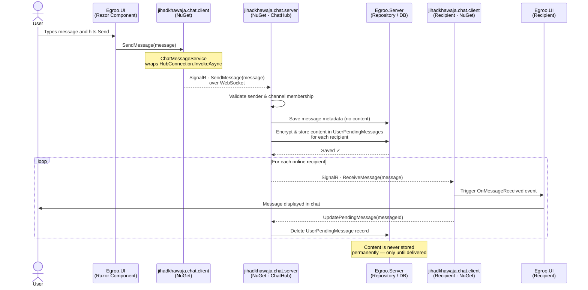

# [Egroo](https://www.egroo.org/)

A **self-hosted**, **real-time** chat web application built using **Blazor** and **ASP.NET**.

## 🚀 Build Status

## ✨ Features

- **Blazor Auto Mode**: 
  - Loads server-side for faster initial page load, then seamlessly switches to WebAssembly (WASM) when cached.
- **Progressive Web App (PWA)**: 
  - Installable on devices for an app-like experience.
- **Real-time Communication**: 
  - Built with SignalR and WebRTC for fast, responsive messaging.
- **Message Privacy**: 
  - Messages are automatically deleted after delivery, ensuring confidentiality.
- **Self-hosted Infrastructure**: 
  - Full control over your data with a customizable backend.

## 💬 How Messaging Works

The three NuGet packages (`jihadkhawaja.chat.client`, `jihadkhawaja.chat.server`, `jihadkhawaja.chat.shared`) work together every time a message is sent:

```mermaid
sequenceDiagram
    actor User
    participant UI as Egroo.UI<br/>(Razor Component)
    participant Client as jihadkhawaja.chat.client<br/>(NuGet)
    participant Hub as jihadkhawaja.chat.server<br/>(NuGet · ChatHub)
    participant Repo as Egroo.Server<br/>(Repository / DB)
    participant RecipientClient as jihadkhawaja.chat.client<br/>(Recipient · NuGet)
    participant RecipientUI as Egroo.UI<br/>(Recipient)

    User->>UI: Types message and hits Send
    UI->>Client: SendMessage(message)
    Note over Client: ChatMessageService<br/>wraps HubConnection.InvokeAsync
    Client-->>Hub: SignalR · SendMessage(message)<br/>over WebSocket
    Hub->>Hub: Validate sender & channel membership
    Hub->>Repo: Save message metadata (no content)
    Hub->>Repo: Encrypt & store content in UserPendingMessages<br/>for each recipient
    Repo-->>Hub: Saved ✓

    loop For each online recipient
        Hub-->>RecipientClient: SignalR · ReceiveMessage(message)
        RecipientClient->>RecipientUI: Trigger OnMessageReceived event
        RecipientUI->>User: Message displayed in chat
        RecipientClient-->>Hub: UpdatePendingMessage(messageId)
        Hub->>Repo: Delete UserPendingMessage record
    end

    Note over Repo: Content is never stored<br/>permanently — only until delivered
```

## 📋 Prerequisites

- **.NET 10** (required) for the latest features and optimizations.
- **Browser**: Any modern browser with WebAssembly support.

## 📚 Documentation

Comprehensive guides and setup instructions are available in our [Wiki](https://github.com/jihadkhawaja/Egroo/wiki):

- **[Getting Started](https://github.com/jihadkhawaja/Egroo/wiki/Getting-Started)** - Quick setup guide
- **[Installation Guide](https://github.com/jihadkhawaja/Egroo/wiki/Installation)** - Detailed installation instructions
- **[Configuration](https://github.com/jihadkhawaja/Egroo/wiki/Configuration)** - Configuration options and settings
- **[Development Setup](https://github.com/jihadkhawaja/Egroo/wiki/Development-Setup)** - Setup for contributors
- **[Deployment Guide](https://github.com/jihadkhawaja/Egroo/wiki/Deployment)** - Production deployment scenarios
- **[API Documentation](https://github.com/jihadkhawaja/Egroo/wiki/API-Documentation)** - REST API and SignalR reference
- **[Architecture Overview](https://github.com/jihadkhawaja/Egroo/wiki/Architecture)** - Technical architecture details
- **[Troubleshooting](https://github.com/jihadkhawaja/Egroo/wiki/Troubleshooting)** - Common issues and solutions

## 📸 Screenshots

### Friends List

### Channels

### Conversations

### Responsive

  
  

## 🤝 Contribution

Contributions are welcome! To get started:

- Fork the repository and submit pull requests.
- Report bugs or request features via the [Issues](https://github.com/jihadkhawaja/Egroo/issues) tab.

## 🌐 Community

Join the discussion on our **[Discord Server](https://discord.gg/9KMAM2RKVC)** to connect, share ideas, and get help.

## 📄 License

This project is licensed under the [**MIT License**](https://github.com/jihadkhawaja/Egroo/blob/main/LICENSE).
