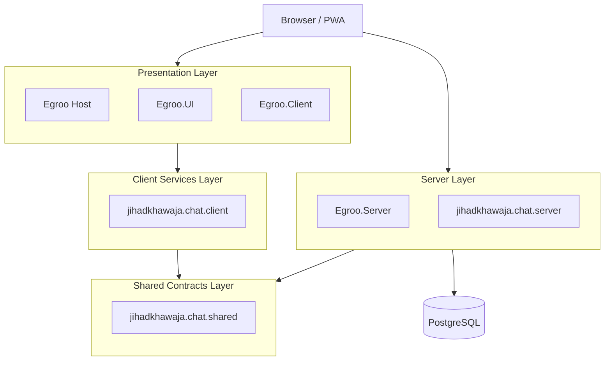
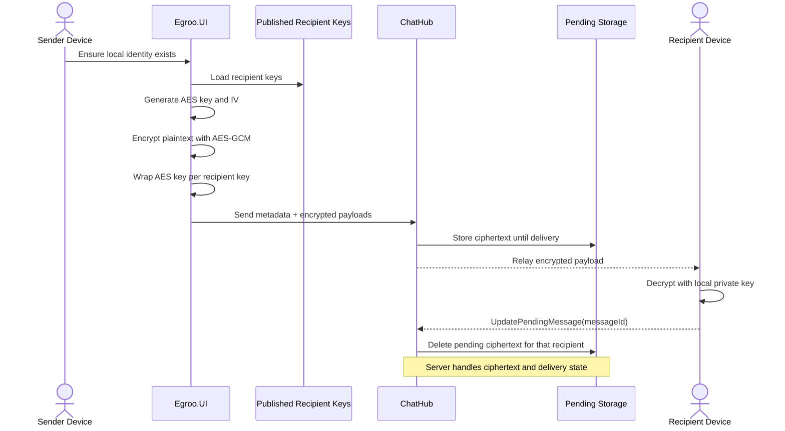
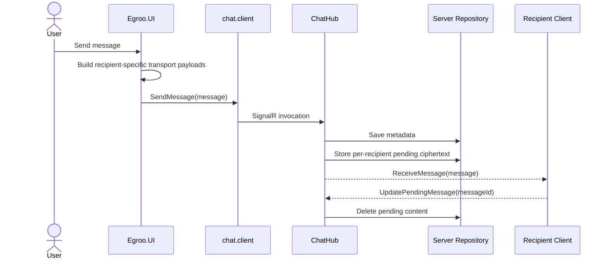
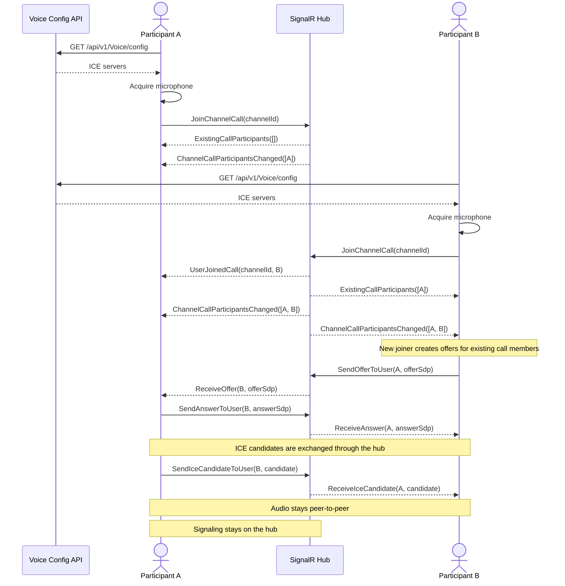
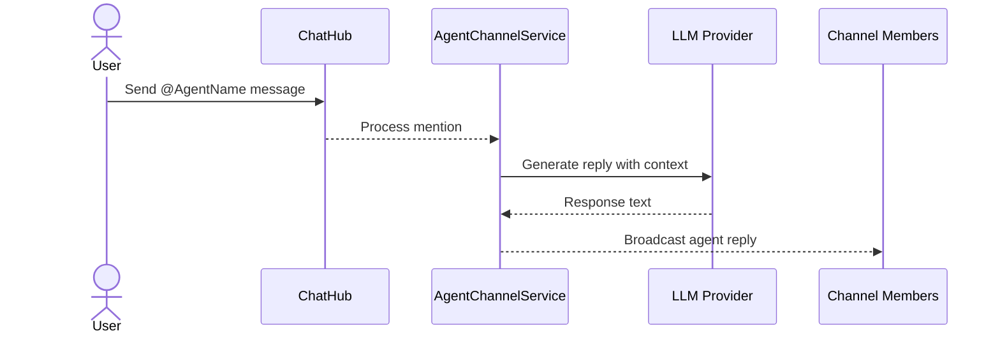

# Architecture Overview

This document summarizes the current Egroo runtime, project boundaries, encryption flow, and the main interaction paths across chat, voice, and agents.

## System Overview

## Project Structure

| Project | Role |
|---|---|
| `src/Egroo/Egroo` | Blazor host application that serves SSR output and the WASM app |
| `src/Egroo/Egroo.Client` | Client-side WebAssembly project |
| `src/Egroo.UI` | Shared Razor component library and client-side UI services |
| `src/Egroo.Server` | ASP.NET Core backend with Minimal APIs, SignalR, EF Core, repositories, and agent services |
| `src/jihadkhawaja.chat.client` | Client chat services that wrap auth, user, channel, message, and call operations |
| `src/jihadkhawaja.chat.server` | SignalR `ChatHub` implementation and connection tracking |
| `src/jihadkhawaja.chat.shared` | Shared models, DTOs, and interfaces |
| `src/Egroo.Server.Test` | MSTest coverage for server behavior |

## Runtime Principles

### Blazor Auto

- the host serves the initial experience quickly with SSR
- the app then hydrates into the WebAssembly client
- shared UI components live in `Egroo.UI`

### SignalR-First Chat

- most interactive user, channel, message, and call behavior flows through `/chathub`
- the hub is configured for WebSockets-only transport
- `jihadkhawaja.chat.client` keeps component code away from raw `HubConnection` details

### Self-Hosted Data Ownership

- PostgreSQL is the authoritative store
- the platform does not depend on a third-party message relay
- production deployment is controlled by your own infrastructure choices

## End-To-End Encryption

Egroo can send per-recipient encrypted message payloads using a hybrid transport scheme. Each user device generates an RSA key pair locally. The private key stays in browser storage. The public key and `keyId` are published to the server so senders can target that device.

For each outbound message, the plaintext is encrypted once with a fresh random AES-GCM key and IV. That AES key is then wrapped with RSA-OAEP-SHA256 for each recipient key. The resulting transport payload is delivered as recipient-specific ciphertext rather than as shared plaintext.

### Encryption Model

- each device can register its own public key and `keyId`
- user profiles still expose legacy single-key fields for backward compatibility, but the active model supports multiple device keys per user
- multi-device recipients use a v2 envelope that carries multiple wrapped AES keys for a single ciphertext payload
- device private keys stay in client storage and are not persisted in PostgreSQL
- `Message.Content` is not stored in the `Messages` table for encrypted delivery
- recipient-specific ciphertext is stored temporarily in `UserPendingMessage` records until acknowledged
- agent recipients use the same transport model, but their private keys are stored server-side in encrypted form
- server-side `EncryptionService` is separate from end-to-end transport and still protects other encrypted server records such as agent API keys and agent private keys

### Key Lifecycle

- a new device generates a local identity and publishes it through the hub
- `AddEncryptionKey` registers an additional device key for the current user
- `GetEncryptionKeys` returns the current device-key set so the user can manage active devices
- `RemoveEncryptionKey` soft-deletes one device key and updates the legacy single-key profile fields
- the repository currently limits each user to 10 active device keys

## Message Delivery Flow

## Voice Channel Calls

Voice calls use channel-scoped WebRTC mesh networking. The client session initializes by requesting `/api/v1/Voice/config`, normalizes the returned ICE servers, and then joins a channel call over SignalR after microphone access is granted locally.

On the server side, `JoinChannelCall` verifies that the caller belongs to the channel. The new joiner receives `ExistingCallParticipants`, existing members receive `UserJoinedCall`, and all online channel members receive `ChannelCallParticipantsChanged` so the UI can keep participant avatars and call state in sync. SDP offers, answers, and ICE candidates are relayed through `ChatHub`, while the media path stays peer to peer.

Operationally, TURN configuration matters in production. If relay-capable ICE servers are returned, the browser forces relay transport on production-like hosts. If no TURN server is configured, the client falls back to STUN-only behavior and warns because calls may fail across NATs or firewalls.

## AI Agents In Channels

Agents are first-class channel participants backed by the Microsoft Agent Framework.

### Agent Architecture Notes

- agent definitions live in shared models and are persisted in PostgreSQL
- `AgentChannelService` loads context, executes the agent runtime, and broadcasts replies
- agent API keys and agent private keys are protected with server-side encryption
- agent replies can also be encrypted for recipients before delivery

## Operational Constraints

- the default `IConnectionTracker` is in-memory and not suitable for horizontal scale on its own
- `db.Database.MigrateAsync()` applies migrations automatically on API startup
- release builds still require updating the compiled API base URL in `src/Egroo.UI/Constants/Source.cs`
- reverse proxies must forward WebSocket upgrades for `/chathub`
