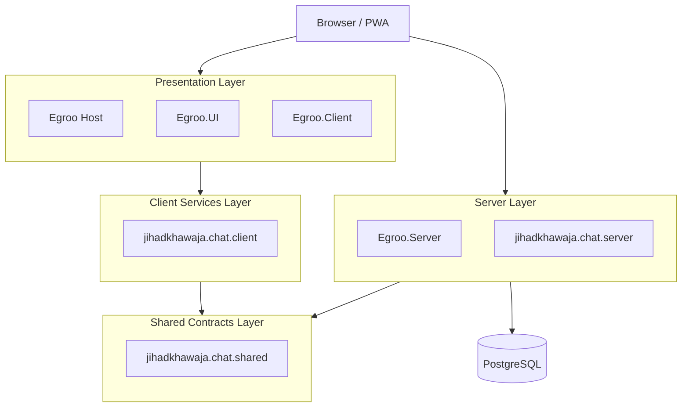
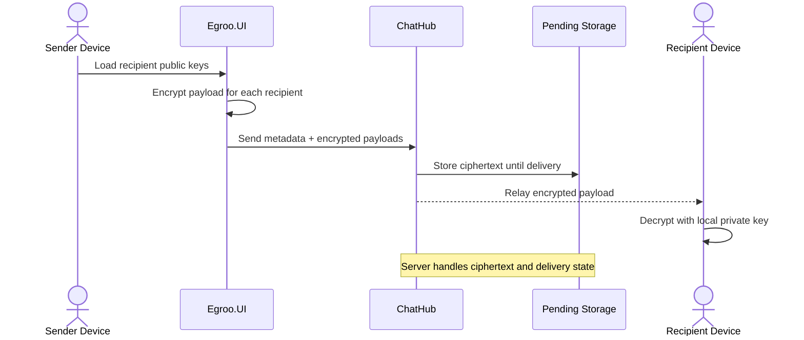
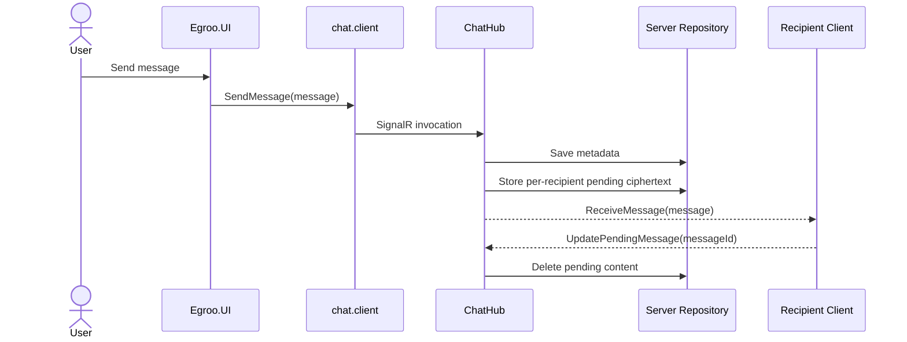
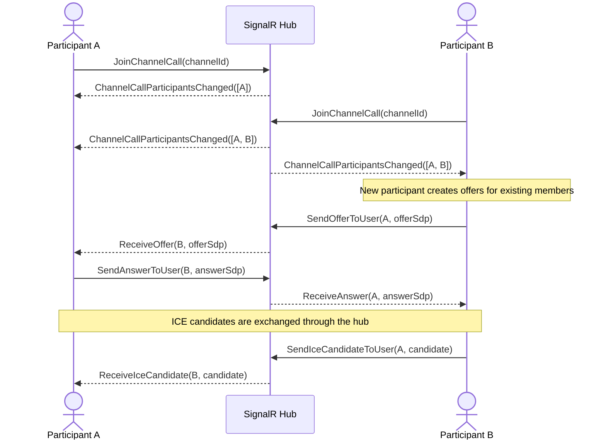
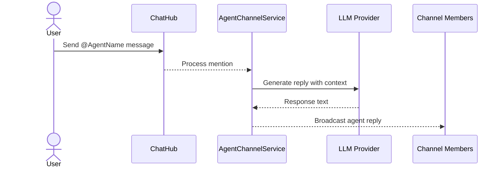

# Architecture Overview

This document summarizes the current Egroo runtime, project boundaries, encryption flow, and the main interaction paths across chat, voice, and agents.

## System Overview

## Project Structure

| Project | Role |
|---|---|
| `src/Egroo/Egroo` | Blazor host application that serves SSR output and the WASM app |
| `src/Egroo/Egroo.Client` | Client-side WebAssembly project |
| `src/Egroo.UI` | Shared Razor component library and client-side UI services |
| `src/Egroo.Server` | ASP.NET Core backend with Minimal APIs, SignalR, EF Core, repositories, and agent services |
| `src/jihadkhawaja.chat.client` | Client chat services that wrap auth, user, channel, message, and call operations |
| `src/jihadkhawaja.chat.server` | SignalR `ChatHub` implementation and connection tracking |
| `src/jihadkhawaja.chat.shared` | Shared models, DTOs, and interfaces |
| `src/Egroo.Server.Test` | MSTest coverage for server behavior |

## Runtime Principles

### Blazor Auto

- the host serves the initial experience quickly with SSR
- the app then hydrates into the WebAssembly client
- shared UI components live in `Egroo.UI`

### SignalR-First Chat

- most interactive user, channel, message, and call behavior flows through `/chathub`
- the hub is configured for WebSockets-only transport
- `jihadkhawaja.chat.client` keeps component code away from raw `HubConnection` details

### Self-Hosted Data Ownership

- PostgreSQL is the authoritative store
- the platform does not depend on a third-party message relay
- production deployment is controlled by your own infrastructure choices

## End-To-End Encryption

Egroo can send per-recipient encrypted message payloads. The server stores and relays ciphertext, while the receiving device decrypts with its local private key.

### Encryption Model

- users can publish `EncryptionPublicKey` and `EncryptionKeyId`
- device private keys stay in client storage
- `Message.Content` is not stored in the `Messages` table
- recipient-specific ciphertext is stored temporarily in pending-message tables until acknowledged
- server-side `EncryptionService` still protects other encrypted server records such as encrypted agent private keys

## Message Delivery Flow

## Voice Channel Calls

Voice calls use WebRTC mesh networking. SignalR manages room membership and signaling, but the media path stays peer to peer.

## AI Agents In Channels

Agents are first-class channel participants backed by the Microsoft Agent Framework.

### Agent Architecture Notes

- agent definitions live in shared models and are persisted in PostgreSQL
- `AgentChannelService` loads context, executes the agent runtime, and broadcasts replies
- agent API keys and agent private keys are protected with server-side encryption
- agent replies can also be encrypted for recipients before delivery

## Operational Constraints

- the default `IConnectionTracker` is in-memory and not suitable for horizontal scale on its own
- `db.Database.MigrateAsync()` applies migrations automatically on API startup
- release builds still require updating the compiled API base URL in `src/Egroo.UI/Constants/Source.cs`
- reverse proxies must forward WebSocket upgrades for `/chathub`
