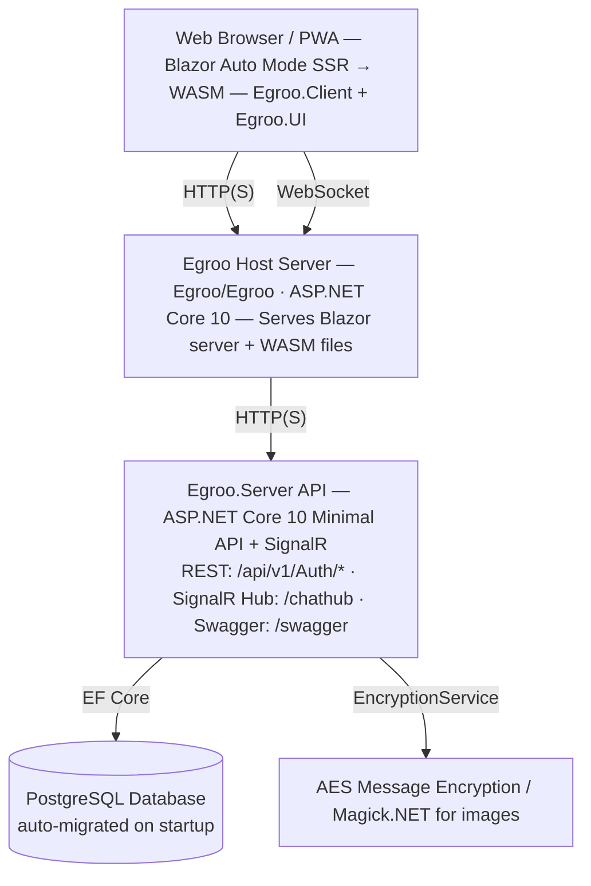
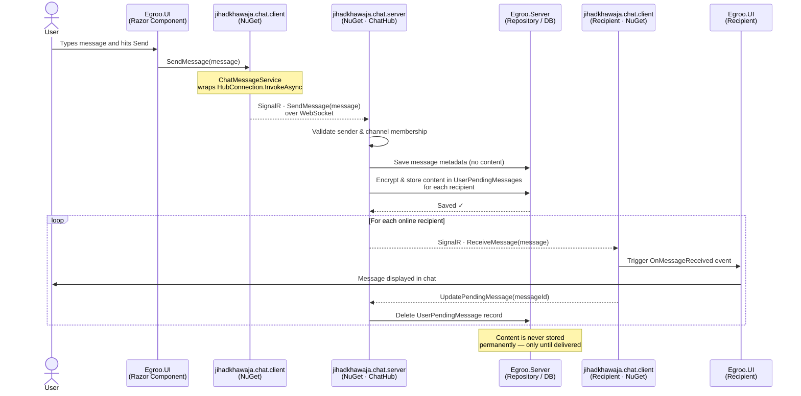
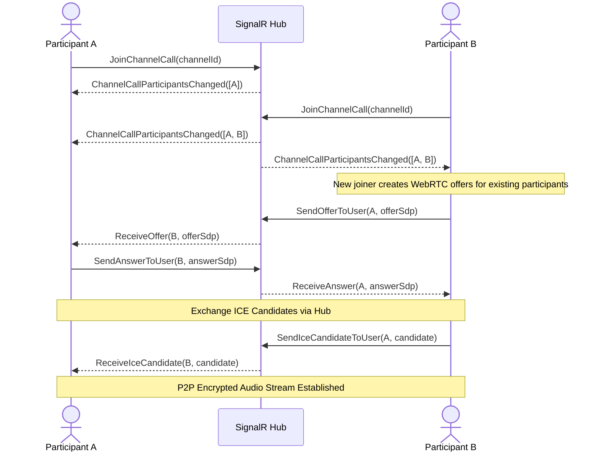

# Architecture Overview

This document provides an accurate overview of Egroo's architecture, design patterns, and technical implementation.

## System Architecture



## Message Flow: How the NuGet Packages Work Together

When a user sends a message the three chat NuGet packages — **`jihadkhawaja.chat.client`**, **`jihadkhawaja.chat.server`**, and **`jihadkhawaja.chat.shared`** — work together in sequence. The diagram below shows each step at a glance.



**Key takeaways:**
- `jihadkhawaja.chat.shared` — defines the `Message` model and `IMessageHub` interface used by both sides.
- `jihadkhawaja.chat.client` — wraps the SignalR `HubConnection` so your UI only calls simple methods like `SendMessage()`.
- `jihadkhawaja.chat.server` — contains the `ChatHub` that runs on the server, handles validation, persistence, encryption, and fan-out to all recipients.
- Message **content is never permanently stored**; it lives only in `UserPendingMessages` and is deleted the moment the recipient picks it up.

---

## WebRTC Channel Voice Calls

Channel voice calls are implemented via a WebRTC Mesh Network. The server orchestrates room membership via SignalR and relays WebRTC signaling, but all voice traffic travels peer-to-peer avoiding the server bottleneck.



---

## Project Structure

The solution contains multiple projects in `src/`:

| Project | Role |
|---------|------|
| `Egroo.Server` | ASP.NET Core API: REST auth endpoints, SignalR hub, database, repositories |
| `Egroo/Egroo` | Blazor host: serves both Server-side and WASM rendering modes |
| `Egroo.Client` | Blazor WebAssembly client project |
| `Egroo.UI` | Shared Razor component library (components, services, constants) |
| `jihadkhawaja.chat.server` | Chat library — SignalR `ChatHub` implementation and `InMemoryConnectionTracker` |
| `jihadkhawaja.chat.client` | Chat library — client-side services (auth, user, channel, message, call) |
| `jihadkhawaja.chat.shared` | Shared models and interfaces used by both server and client |
| `Egroo.Server.Test` | Integration tests for the API server |

## Design Principles

### 1. Blazor Auto Mode
- **Server-Side Rendering (SSR)**: Fast initial page load with pre-rendered HTML
- **WebAssembly (WASM)**: Seamless switch to fully client-side rendering after the WASM bundle is cached
- Both rendering modes share the same Razor components in `Egroo.UI` and `Egroo.Client`

### 2. SignalR-First Real-time Architecture
- All user, friend, channel, and message operations are performed through the **SignalR hub** at `/chathub`
- The hub uses **WebSockets only** — no fallback to long-polling or server-sent events
- **Connection tracking** is handled per user via `IConnectionTracker` (default: `InMemoryConnectionTracker`); can be replaced with a Redis-backed implementation for distributed deployments

### 3. Message Privacy
- Message `Content` is **not stored** in the `Messages` database table (`[NotMapped]`)
- Content is stored encrypted in `UserPendingMessages` until each recipient acknowledges delivery
- Once delivered (via `UpdatePendingMessage`), the pending record is removed
- Encryption uses AES via `EncryptionService` (configurable Key + IV in `appsettings.json`)

### 4. Self-Hosted / Data Ownership
- No third-party message routing — all data stays on your own PostgreSQL instance
- Docker-ready with official container images

### 5. Progressive Web App (PWA)
- Installable on mobile and desktop
- Service worker enables offline capability and background caching

## Server Architecture (Egroo.Server)

### Service Registration (`Program.cs`)


## Database Schema

The database uses **Entity Framework Core** with **Npgsql** (PostgreSQL provider). Migrations are applied automatically on application startup.

### Key Entities

#### `Channel`
| Column | Type | Notes |
|--------|------|-------|
| `Id` | `Guid` (PK) | Auto-generated |
| `Title` | `string?` | Optional custom title |
| `IsPublic` | `bool` | Whether discoverable via search |
| `DateCreated` | `DateTimeOffset?` | Audit |
| `DateUpdated` | `DateTimeOffset?` | Audit |
| `DateDeleted` | `DateTimeOffset?` | Soft delete |

#### `ChannelUser`
| Column | Type | Notes |
|--------|------|-------|
| `Id` | `Guid` (PK) | |
| `ChannelId` | `Guid` | FK to Channel |
| `UserId` | `Guid` | FK to UserDto |
| `IsAdmin` | `bool` | Admin flag |

#### `Message`
| Column | Type | Notes |
|--------|------|-------|
| `Id` | `Guid` (PK) | |
| `SenderId` | `Guid` | |
| `ChannelId` | `Guid` | |
| `ReferenceId` | `Guid` | Client-generated idempotency key |
| `DateSent` | `DateTimeOffset?` | |
| `DateSeen` | `DateTimeOffset?` | |
| ~~`Content`~~ | ~~`string`~~ | **Not mapped** — not stored |

#### `UserPendingMessage`
| Column | Type | Notes |
|--------|------|-------|
| `Id` | `Guid` (PK) | |
| `UserId` | `Guid` | Recipient |
| `MessageId` | `Guid` | FK to Message |
| `Content` | `string?` | Encrypted message content |
| `DateUserReceivedOn` | `DateTimeOffset?` | Delivery timestamp |

#### `UserDto`
| Column | Type | Notes |
|--------|------|-------|
| `Id` | `Guid` (PK) | |
| `Username` | `string` | Unique |
| `Role` | `string` | User role |
| `LastLoginDate` | `DateTimeOffset?` | |
| `UserDetail` | (nav) | Related detail record |
| `UserStorage` | (nav) | Avatar + cover storage |

#### `UserFriend`
| Column | Type | Notes |
|--------|------|-------|
| `Id` | `Guid` (PK) | |
| `UserId` | `Guid` | |
| `FriendUserId` | `Guid` | |
| `DateAcceptedOn` | `DateTimeOffset?` | Null = pending |

## Security Architecture

### JWT Authentication
- Tokens are validated on every request (REST and SignalR via `access_token` query param)
- `ValidateLifetime = true` — expired tokens are rejected
- Issuer and audience validation are disabled (single-service deployment)
- JWT secret must be at least 32 characters (configured in `Secrets.Jwt`)

### Message Encryption
- `EncryptionService` uses **AES** with a configurable Key (32 chars) and IV (16 chars)
- Message content is encrypted before being written to `UserPendingMessages`
- Content is decrypted just before delivery to the recipient via `DecryptContent()`

### Image Processing
- **Magick.NET** (ImageMagick) is used to process and validate avatar and cover images before storage

### Rate Limiting
- All REST endpoints are covered by a `FixedWindowLimiter`: 100 req/min, queue up to 10

### CORS
- `AllowedOrigins` from `Api:AllowedOrigins` configuration
- In `DEBUG` builds, CORS is always fully open (any origin allowed)

## Client Architecture (Egroo.UI + Egroo.Client)

### Shared UI Library (`Egroo.UI`)


## Deployment Architecture

### Container Images
| Image | Purpose |
|-------|---------|
| `jihadkhawaja/egroo-server-prod:latest` | Egroo.Server API |
| `jihadkhawaja/egroo-client-prod:latest` | Egroo Blazor host |

### `docker-compose-egroo.yml`
The production compose file places both containers on an **external** Docker network (`internal`) — PostgreSQL is expected to be provisioned separately (e.g., a managed database or a separate compose stack).

Memory limits: API → 512 MB, Web → 256 MB.

## Extension Points

### Custom Connection Tracker
Replace the default `InMemoryConnectionTracker` with a Redis-backed implementation for multi-instance deployments:
```csharp
// Register before AddChatHub()
services.AddSingleton<IConnectionTracker, MyRedisConnectionTracker>();
builder.Services.AddChatHub();
```

### Custom Cache Provider
Implement `IChatCacheProvider` to swap out the client-side message storage backend (IndexedDB, SQLite, etc.):
```csharp
services.AddScoped<IChatCacheProvider, MyIndexedDbCacheProvider>();
```
